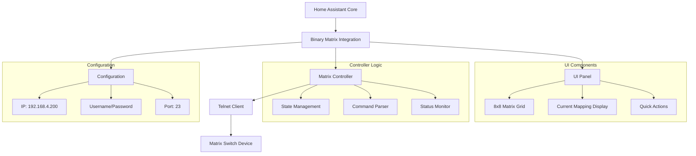
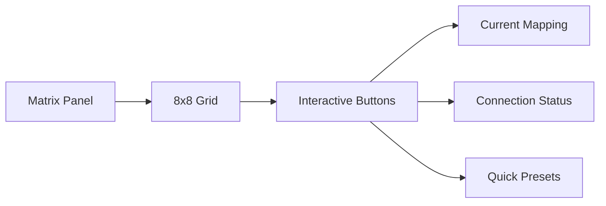
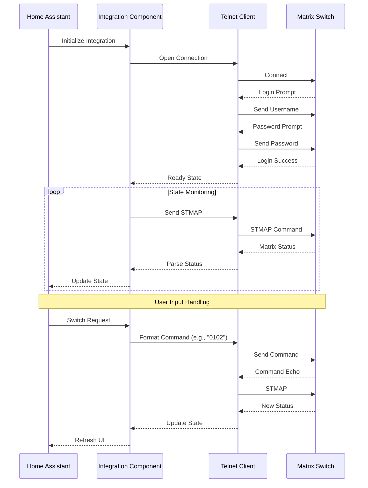

# Binary Matrix 8x8 HDMI Switcher - Home Assistant Integration Plan

## Overview
This document outlines the implementation plan for integrating a Binary Matrix 8x8 HDMI switcher with Home Assistant via telnet connection.

## Technical Specifications

### Connection Details
- IP Address: 192.168.4.200
- Port: 23
- Username: admin
- Password: 123

### Command Structure
- Output to Input mapping: `XXYY` (XX=output number 01-08, YY=input number 01-08)
- Status Command: `STMAP` 
- Example command: `0102` (connects output 01 to input 02)

### Expected Responses
```
# Login Sequence
Telnet Server
(for this demo, type 'admin' for the login and '123' for the password.)
Login: admin
Password: 123

Logged in successfully

Press 'q' to quit
>

# Status Map Response
>STMAP
STMAP
o01i02
o02i05
o03i01
o04i02
o05i01
o06i05
o07i07
o08i03
>
```

## Component Architecture



## Implementation Components

### 1. Directory Structure
```
custom_components/
└── binary_matrix/
    ├── __init__.py
    ├── manifest.json
    ├── config_flow.py
    ├── const.py
    ├── matrix_controller.py
    ├── strings.json
    └── translations/
```

### 2. Core Components

#### Telnet Client
- Handle connection establishment
- Authentication sequence
- Command sending/receiving
- Auto-reconnect on failure
- Response parsing

#### Matrix Controller
- State management for 8x8 matrix
- Command queuing and execution
- Regular status polling (STMAP)
- State change notifications

#### Home Assistant Integration
- Config flow for setup
- Service registration
- State updates
- Event handling

### 3. UI Implementation



## Communication Flow



## Configuration Example

```yaml
binary_matrix:
  host: 192.168.4.200
  port: 23
  username: "admin"
  password: "123"
  scan_interval: 30  # Status check interval in seconds
```

## Error Handling

1. Connection Issues
   - Automatic reconnection attempts
   - Exponential backoff
   - Status reporting to HA

2. Command Failures
   - Retry logic
   - State verification
   - Error reporting

3. State Synchronization
   - Regular status polling
   - State verification after commands
   - Conflict resolution

## Implementation Steps

1. **Phase 1: Core Implementation**
   - Basic telnet client
   - Authentication handling
   - Command/response parsing
   - State management

2. **Phase 2: HA Integration**
   - Config flow setup
   - Service registration
   - State management
   - Basic UI

3. **Phase 3: UI Enhancement**
   - Matrix grid implementation
   - Status visualization
   - Quick actions
   - Presets

4. **Phase 4: Testing & Refinement**
   - Connection stability
   - Error handling
   - Performance optimization
   - Documentation